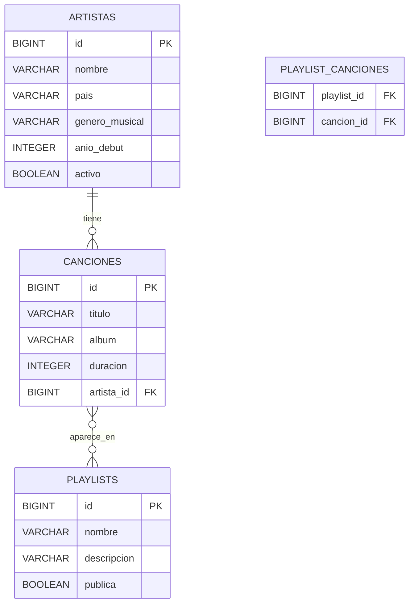
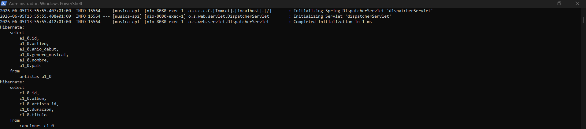
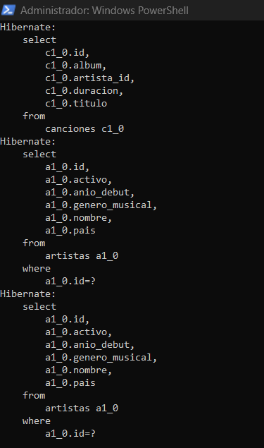

# Documento de diseno - Musica API

## Dominio

La aplicacion gestiona un catalogo musical con artistas, canciones y playlists. El objetivo es practicar persistencia JPA, relaciones entre entidades, busquedas con parametros, consultas JPQL, validacion y seguridad en endpoints de escritura.

## Diagrama ER

## Entidades y relaciones

- `Artista`: entidad principal con datos del artista.
- `Cancion`: pertenece a un artista mediante `@ManyToOne` y `@JoinColumn(name = "artista_id")`.
- `Artista.canciones`: lado inverso `@OneToMany(mappedBy = "artista")`.
- `Playlist`: agrupa canciones.
- `Playlist.canciones`: relacion `@ManyToMany` con tabla intermedia `playlist_canciones`.

`@JsonIgnore` se usa en `Artista.canciones` y `Cancion.playlists` para evitar bucles infinitos al convertir las entidades a JSON. `@ToString.Exclude` se usa en los mismos puntos de relacion para evitar recursividad al generar el `toString` con Lombok.

## Lista de endpoints

| Metodo | Ruta | Descripcion |
| --- | --- | --- |
| GET | `/api/v1/artistas` | Lista todos los artistas |
| GET | `/api/v1/artistas/{id}` | Busca un artista por id |
| POST | `/api/v1/artistas` | Crea un artista |
| PUT | `/api/v1/artistas/{id}` | Actualiza un artista |
| DELETE | `/api/v1/artistas/{id}` | Elimina un artista |
| GET | `/api/v1/artistas/buscar?nombre=...&genero=...&sortBy=id&order=asc` | Busca artistas con parametros opcionales |
| GET | `/api/v1/canciones` | Lista todas las canciones |
| GET | `/api/v1/canciones/{id}` | Busca una cancion por id |
| POST | `/api/v1/canciones` | Crea una cancion |
| PUT | `/api/v1/canciones/{id}` | Actualiza una cancion |
| DELETE | `/api/v1/canciones/{id}` | Elimina una cancion |
| GET | `/api/v1/canciones/buscar?titulo=...&sortBy=id&order=asc` | Busca canciones por titulo y orden |
| GET | `/api/v1/canciones/artista/{artistaId}` | Lista canciones de un artista |
| GET | `/api/v1/canciones/artista/{artistaId}/contador` | Cuenta canciones de un artista con JPQL |
| GET | `/api/v1/playlists` | Lista todas las playlists |
| GET | `/api/v1/playlists/{id}` | Busca una playlist por id |
| POST | `/api/v1/playlists` | Crea una playlist |
| PUT | `/api/v1/playlists/{id}` | Actualiza una playlist |
| DELETE | `/api/v1/playlists/{id}` | Elimina una playlist |
| GET | `/api/v1/playlists/buscar?nombre=...` | Busca playlists por nombre |
| PUT | `/api/v1/playlists/{playlistId}/canciones/{cancionId}` | Anade una cancion a una playlist |
| GET | `/api/v1/playlists/artista/{artistaId}` | Busca playlists con canciones de un artista usando JPQL |

## Decisiones tecnicas

- Base de datos: H2 en fichero (`jdbc:h2:file:./data/musica-db`) para que los datos persistan entre arranques.
- Arquitectura: separacion `Controller -> Service -> Repository`. Los controladores no acceden directamente a repositorios.
- `Optional`: los `findById` devuelven `Optional<T>` y los controladores responden con `200 OK` o `404 Not Found` usando `map(...).orElse(...)`.
- Busquedas: se usan query params opcionales con `@RequestParam` y metodos derivados como `findByTituloContainingIgnoreCase`.
- Ordenacion: `sortBy` y `order` permiten cambiar el orden en endpoints de busqueda.
- JPQL: `contarCancionesPorArtista` y `buscarPlaylistsConCancionesDeArtista` usan entidades Java y sus relaciones, no nombres de tablas SQL.
- Seguridad: Spring Security con Basic Auth. Los `GET` son publicos y los `POST`, `PUT` y `DELETE` requieren credenciales.
- Calidad: validacion con `@Valid`, `@NotBlank`, `@NotNull`, `@Size` y `@Min`; errores centralizados con `@RestControllerAdvice`.

## Capturas de base de datos

Capturas reales desde `http://localhost:8080/h2-console` mostrando las tablas generadas por JPA:

- `ARTISTAS`
- `CANCIONES`
- `PLAYLISTS`
- `PLAYLIST_CANCIONES`

Capturas de la consola del servidor mostrando SQL generado por Hibernate, con `spring.jpa.show-sql=true` activado:

## Pruebas recomendadas para la defensa

1. `GET /api/v1/artistas`
2. `GET /api/v1/canciones/artista/1`
3. `GET /api/v1/canciones/buscar?titulo=mal`
4. `GET /api/v1/canciones/buscar?titulo=a&sortBy=duracion&order=desc`
5. `GET /api/v1/playlists/artista/1`
6. `GET /api/v1/canciones/artista/1/contador`
7. `POST /api/v1/artistas` sin Basic Auth para mostrar `401`
8. `POST /api/v1/artistas` con Basic Auth para mostrar `201`
9. `POST /api/v1/artistas` con campos vacios para mostrar error de validacion
